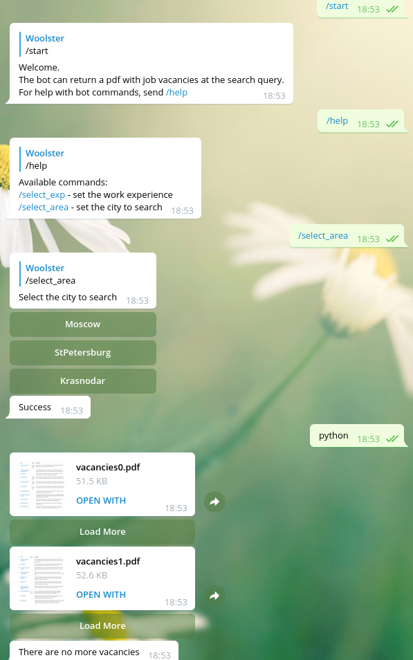

# tg-bot-parser-hhru

Bot for job search on hh.ru



## Setup

Set environment variables:

* TG_BOT_TOKEN - bot token received from BotFather
* WEBHOOK_HOST - bot domain name

## Installation

Install wkhtmltopdf:

* Debian/Ubuntu:

```sh
sudo apt-get install wkhtmltopdf
```

Install dependencies:

```sh
# pip or pip3 or python3 -m pip
pip install -r requirements.txt
```

## Start the bot

```sh
./start.sh
```
